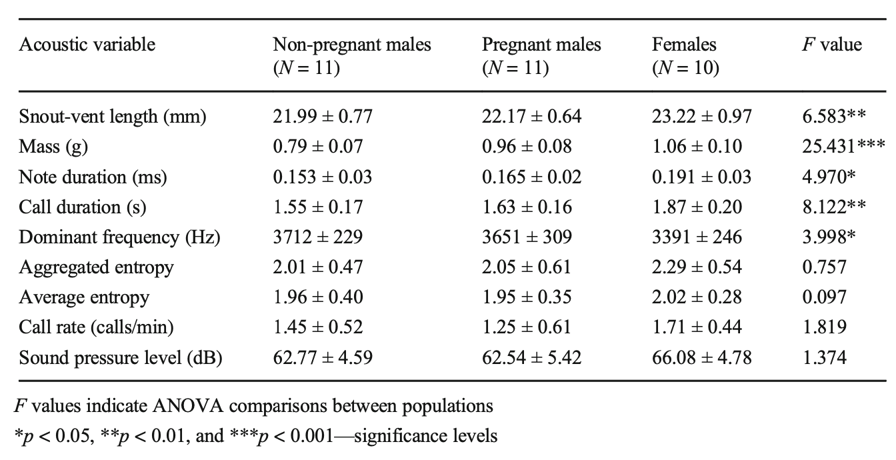
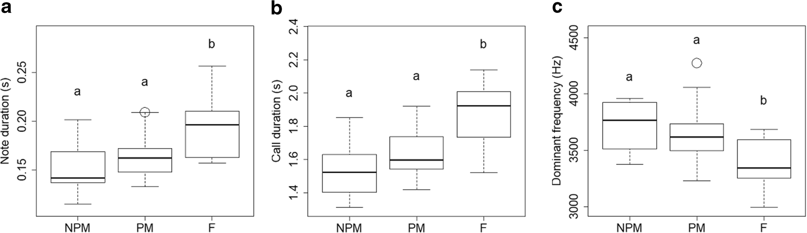
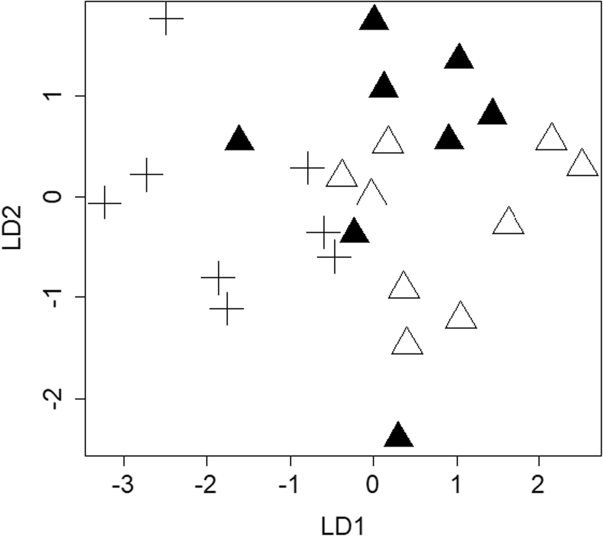

```{r setup, include=FALSE}
# These are some {knitr} options I typically use to format my ***RMarkdown*** documents in a consistent way
# You should feel free to alter these or use other "chunk options" as you see fit!
# Sometimes, for example, you might want to suppress warnings or
# messages, and that behavior can be set for specific code chunks in
# the chunk header, e.g., ```{r warning = FALSE, echo = FALSE}
knitr::opts_chunk$set(
  eval = TRUE, # run code in code chunks
  echo = TRUE, # render output of code chunks
  warning = TRUE, # do not suppress "warnings"
  message = TRUE, # do not suppress "messages"
#  comment = "##", # prefix for comment lines
#  prompt = ">", # prefix for code lines
  tidy = TRUE,
  tidy.opts = list(blank = FALSE, width.cutoff = 75),
  fig.path = "images/", # name of folder for images
  fig.align = "center" # centers any images on the page
)
```

# Darwins Frog Monomorphic Call Structure and Dimorphic Vocal Phenology\
```{r Preliminaries, message=FALSE}
#require = will install and load, library can only load installed packages
require(tidyverse)
require(ggplot2) # pretty plots
require(dplyr) # dataframe manipulations and  %>% 
require(infer) #  statistics
require(tidyr) # nice tables that look nice
require(car) # ANOVA, also used by the authors for ANOVA
require(mosaic) # histogram, instead of hist (contains {lattice})
require(formatR) #to format R
require(knitr) # inserting images
require(kableExtra) # modifying kable tables
require(skimr) # for data overview, data visualization 
require(data.table) #
```


## introduction:\
[Include a brief summary of the paper you are reanalyzing data from (e.g., the overall objective of the paper, the types of data collected and how sampling was done, what the main results were) and lay out what you intend to replicate.]\
```{r echo=FALSE, out.width="100%", message=FALSE}
include_graphics("images/Cornett_2019_Darwin's_Frog.JPG") #cool frog photo by me
```

#### **background**\
The southern Darwin's frog (*Rhinoderma darwinii*) mouth-brooding frog species endemic to Chilean Patagonia. *R. darwinii* has a fascinating method for reproduction: the female (egg-producer) deposits eggs and  the male (sperm-producer) fertilizes them, then guards them until the embryos are visibly wriggling inside. Then the male transfers those eggs to their vocal sac where they will be safe from predators and receive nutrients from the male (similar to marsupial embryonic development in their pouch). Ultimately, the male broods these fertilized eggs, often from multiple clutches with different partners, in their vocal sacs for about 50 days, until fully developed froglets emerge by pushing their way out the male’s mouth! All a while during this gestation period, the male continues to call for mates (Sandmeier, 2016)! There are 3 sex roles in this species: pregnant male (MP), non-pregnant male (M or NPM), and female (H or F), and the main sexually dimorphic characteristic is size, where the egg-producers (F) are slightly larger. In this nearly sexually monomorphic (i.e., the sexes look physically identical) species, mate selection depends on advertising calls, and *R. darwinii* is one of the few species where all sexes (PM, NPM, and F) use advertising calls to attract the attention of a potential mate (Serrano et al., 2020).\

#### **hypothesis**\
To investigate the factors modulating monomorphic vs. dimorphic sexual signals in the *R. darwinii*, Serrano et al. (2020) hypothesized species with temporally variable periods of intrasexual competition will have monomorphic instead of dimorphic sexual signals to ensure conspecific recognition. In *R. darwinii*, they specifically focus on timing/availability of advertising calls for mate attraction used by calling (pregnant and non-pregnant) males and calling females (i.e., vocal phenology) (Serrano et al., 2020).

#### **methods**\
They investigated this with a population of southern *R. darwinii* on Chiolé Island in Southern Chile during mating season (October 2015-February 2016). Of the 156 frogs caught in the field (118 adults), they recorded calls from 32 of them (**Plot1**) In the field, they first recorded individual calls (tracks) then collected population monitoring data (snout-vent length, SVL (mm); weight (g)). They also collected data on the sex and sexual status (MP = pregnant male, H = female, M = non-pregnant male) of each frog caught using body size and morphological characteristics. For the pregnant males, they counted externally the number of larvae in the vocal sacs. For each call recordings, they measured the call repetition rate (CRR, number of calls made in a 5 min period after the first call produced), the sound pressure level (SPL, dB), call duration (CD, seconds), the number of notes per call (NC), the note duration (ND, ms), the dominant frequency of the call (DF, Hz); and the amplitude of each vocalization (root mean square (RMS) amplitude) (Serrano et al., 2020).\
The Serrano et al. (2020) used *Simple Pearson correlations* to explore the association used to explore association between **acoustic variables of the calls (CRR, SPL, CD, NC, ND, DF)** with **physical characteristic variables (SVL, weight)** (data not shown in article). They used *Spearman correlations* to determine the association between **acoustic properties of the calls of pregnant males** and the **number of tadpoles in their vocal sacs** (data not shown in article). The authors used an *ANOVA* to investigate the differences in acoustic variables depended on the relative body size of the sexes (Table 1), then they conducted a discriminant function analysis (DFA) for the note duration, dominant frequency, sound pressure level, and aggregated entropy of 4-notes calls (the most common call structure), then analyzed using two linear discriminant vectors (LD) (Figure 4) (Serrano et al., 2020). 

#### **results**\
Ultimately, Serrano et al. (2020) found females, who have larger body size (SVL and weight) than both male sexes, had longer note duration and call duration than any males (Table 1, Figure 3), and, even when data was corrected for SVL, no acoustic variable had a significant difference between the sexes, based on their ANOVA (Table 1), suggesting body size explains any variation among the acoustic variables and a monomorphic call structure. They also found a negative relationship between number of tadpoles in the vocal sacs of pregnant males and their call amplitude, indicating the advertising call of pregnant males is attenuated by an increased number of tadpoles AND could be an auditory indicator of tadpoles thus could be used for selecting a mate (data not shown;  just very cool! This is something several other students and I studied with the first author of this paper in the field in 2019)! Ultimately, they propose mutual selective pressures of the different sexes might contribute to social recognition and sexual status recognition (i.e., recognition of reporoductive state, active or not) of individuals (Serrano et al., 2020).

### **data replication**\
I will be replicating the descriptive statistic analysis of the qqPlots, Simple Pearson Correlation, Simple Spearman correlation to explore normality trends in the data, just as the authors did, and ANOVA presented in Table 1 of Serrano et al. (2020). THen I will be replicating the Inferential statistical analysis of acoustic variables note duration, call duration, and  dominant frequency (figure 3). Lastly, I will replicate the linear discrimination analysis of 5 acoustic variables (Dominant Frequency, Call Rate, Note Duration, Aggregated entropy, and Sound Pressure Level) (figure 4).


## visualization of data\
**load in dataset:**
```{r load in dataset}
f <- "https://raw.githubusercontent.com/slcornett/data-analysis-replication/main/data/Serrano_et_al_2020_MPMH.csv"
d <- read_csv(f, col_names = TRUE, show_col_types = FALSE) # show column names, hides dataframe message details
d <- d %>% mutate(CRR = (Calls5min/5))# creating calls per minute call repetition rate for ease in future calculations
```
### data summary statistics
```{r data summary}
# Data summary 
s <- skim(d) # to make a summary table of skim(d) output
# character data
s %>% dplyr::filter(skim_type == "character") %>% 
  dplyr::select(skim_variable, n_missing, character.min, character.max, character.empty, character.n_unique) %>% 
  kable(align = 'l', booktabs = TRUE) %>% 
  kable_styling(font_size = 11, full_width = TRUE)
# numeric data modify the specific output
s %>% dplyr::filter(skim_type == "numeric") %>%
  dplyr::select(skim_variable, n_missing, numeric.mean, numeric.sd, numeric.p0, numeric.p25, numeric.p50, numeric.p75, numeric.p100, numeric.hist) %>%
  kable(align = 'l', booktabs = TRUE) %>% # left aligned data
  kable_styling(font_size = 11, full_width = TRUE) # font-size

detach(package:skimr)
```
#### Abbreviation definitions:\
**DESCRIPTIONS/IDENTIFIERS:**   
  • Nombre =  name given to ID the frog;\
  • Captura = number captured/image name;\
  • Track = the call recording track\
**PHYSICAL MEASUREMENTS:**\
  • sexo = sexual status (MP = pregnant male, H = female, M = non-pregnant male)\
  • peso = mass (g);\
  • LHC = longitud hocico a cola (snout-vent length, mm);\
  • temp = temperature (ºC);\
  • HR = relative humidity;\
  • larvas = number of tadpoles/offspring in their parent's mouth!\
**ACOUSTIC VARIABLES:** \
  • Calls5min = calls in 5 min interval;\
  • SPL = Sound Pressure Level (dB);\
  • NC = number of notes/call;\
  • ND = note duration (either s or ms);\
  • CD = call duration (s);\
  • Agg Entropy = aggregate entropy;\
  • Avg Entropy = average entropy;\
  • DF = dominant frequency of call (Hz);\
  • RMS Amp = Root Mean Square Amplitude\
  • CRR = Call Repetition Rate (Calls/min, i.e., Calls5min/5)
  
#### exploratory statistics and comparisons of data:
```{r Exploratory Plots, message=FALSE, warning=FALSE}
require(cowplot) # for grid plotting
# not included in article as a graph but i think it's nice to show for reference to the methods
p1 <- ggplot(data = d,  # object created
             aes(x = Sex, # sex of individuals in the dataset
                 y = LHC)) + # y =  SVL, one value dropped b/c NA  
  geom_boxplot(na.rm = TRUE, show.legend = FALSE, aes(color = Sex)) +
  labs(x = "Sex of Frog at time of Capture", y = "Snout-Vent Length (mm)") +
  ggtitle("Body Size of R. Darwinii Frogs Incluced in this Study") +
  theme_classic() + # don't need the legend because x is categorical
  theme(plot.title = element_text(size = 10, color = "dark green", face = "bold"),
        axis.title.x = element_text(size = 8, color = "dark green"),
        axis.title.y = element_text(size = 8, color = "dark green"))
# CRR by Sex
p2 <- ggplot(data = d, aes(x = Sex, y = CRR, color = Sex)) + 
  geom_boxplot(na.rm = TRUE, show.legend = FALSE) + # don't need the legend because x is categorical
  labs(x = "Sex", y = "Calls/min") +
  ggtitle("Call Repetition Rate by Sex") +
  theme_classic() +
  theme(plot.title = element_text(size = 10, color = "dark green", face = "bold"),
        axis.title.x = element_text(size = 8, color = "dark green"),
        axis.title.y = element_text(size = 8, color = "dark green")) 
# Notes per Call (NC) vs Sex
p3 <- ggplot(data = d, aes(x = Sex, y = NC, color = Sex)) + 
  geom_boxplot(na.rm = TRUE, show.legend = FALSE) + # don't need the legend because x is categorical
  labs(x = "Sex", y = "Notes per Call") +
  ggtitle("Notes per Call by Sex") + 
  theme_classic() +
  theme(plot.title = element_text(size = 10, color = "dark green",face = "bold"),
        axis.title.x = element_text(size = 8, color = "dark green"),
        axis.title.y = element_text(size = 8, color = "dark green"))
# Call Repetition Rate (CRR) histogram
p4 <- ggplot(data = d, aes(x = CRR, color = Sex)) +
  geom_histogram(na.rm = TRUE, show.legend = FALSE) + facet_wrap( ~ Sex) + 
  labs(x = "Calls per Minute", y = "Frequency of Call Rate") +
  ggtitle("Histogram of Call Repetition Rate") + 
  theme_classic() +
  theme(plot.title = element_text(size = 10, color = "dark green", face = "bold"),
        axis.title.x = element_text(size = 8, color = "dark green"),
        axis.title.y = element_text(size = 8, color = "dark green"))
# pregnant males : number of tadpoles vs call amplitude
p5 <- ggplot(data = d, aes(x = as.factor(Larvas), y = `RMS Amp`, color = Larvas)) + 
  geom_boxplot(na.rm = TRUE, show.legend = FALSE) + # filtering out all but pregnant males because other sexes don't have tadpoles.
  xlab("Number of Tadpoles") +
  ylab("Call Amplitude (dB)") +
  ggtitle("Pregnant Males: Number of Tadpoles vs Call Amplitude") +
  theme_classic() +
  theme(plot.title = element_text(size = 10, color = "dark green", face = "bold"),
        axis.title.x = element_text(size = 8, color = "dark green"),
        axis.title.y = element_text(size = 8, color = "dark green"))
# plotting the graphs together
plot_grid(p1, p2, p3, p4, p5, label_size = 8, nrow = 3)
```

## Statistical Replications/Reanalysis
>Be sure to **thoroughly** explain what replications you are doing and comment your code so that it is easy for a reader to understand.  
Include in this section relevant tables/figures/values from the original paper for comparison to what you accomplished with your replication.  
Note that I want you to do the bulk of any *exposition* using text and markdown syntax outside of code blocks. That is, your document should not just be one big code block with ***R*** style comments but rather a nicely formatted report with code separated from exposition, interpretation, and discussion.]\

```{r selecting variables and organizing data by sex}
# making a dataframe of the relevant variables so don't change the original dataset. 
df<- d %>% dplyr::select(Nombre, Sex, Larvas, LHC, Peso, Calls5min, CRR, NC, ND, CD, DF, SPL, `RMS Amp`, `Agg Entropy`, `Avg Entropy`)
# renaming Sex variables in dataframe so will print nicer in the Tukey post-hoc. yes I could just use Sexo but I don't have to change all the code below if i do it like this. I didn't realize the labels were going to be a problem until after I wrote all the code for replication. Also now my visualization labels will match those used in the paper.  
df <- df %>%
    mutate(Sex = case_when(Sex == "Females" ~ "F", 
                           Sex == "Non-pregnant males" ~ "NPM", 
                           Sex == "Pregnant males" ~ "PM"))
print(df) %>% 
  kable(align = 'l', booktabs = TRUE) %>% # left aligned data
  kable_styling(font_size = 10, full_width = TRUE) # font-size# checking work

# dividing df by sex so easier to access variables. Commented  out the ones i don't actually need in the replication. 
# np.males <- df %>% dplyr::filter(Sex == "Non-pregnant males") #Non-pregnant males (N = 11) 
# head(np.males) 
p.males <- df %>% dplyr::filter(Sex == "PM") # Pregnant males (N = 11)
head(p.males)
# females <- df %>% dplyr::filter(Sex == "Females") # Females (N = 9, according to the article, N=10, but the dataset only has 9.)
# head(females)
```


### Table 1: Average ± SD of Body Size and Acoustic Features for *R. darwinii*\
[descriptive statistical analysis]
```{r Serrano_et_al_2020_Table1, echo=FALSE, width="300px", message=FALSE}

```


The authors reported performing the following statistical analyses before performing their ANOVA. As mentioned before, they used **Simple Pearson Correlations** to determine if the different acoustic variables correlate with either **Snout-Vent Length (LHC, mm)** or **mass (g)** (Serrano et al., 2020). They also performed **Spearman Correlations** to determine an association between acoustic variables and the number of tadpoles in the vocal sacs of pregnant males (Serrano et al., 2020). Below, I repeat these tests.
```{r correlation tests}
# SHOULD I TAKE THESE OUT? THEY AREN'T VERY INFORMATIVE. 

# Pearson correlations between snout-vent length and acoustic variables
# Snout Vent Length (LHC, mm) vs Note Duration (s)
stats::cor.test(df$LHC, df$ND, method = "pearson") # no correlation
# Snout Vent Length (LHC, mm) vs Call Duration (s)
stats::cor.test(df$LHC, df$CD, method = "pearson") # no correlation
# Snout Vent Length (LHC, mm) vs Dominant Frequency (Hz)
stats::cor.test(df$LHC, df$DF, method = "pearson")
# Snout Vent Length (LHC, mm) vs Aggregate Entropy
stats::cor.test(df$LHC, df$`Agg Entropy`, method = "pearson") # near correlation (p = 0.058)
stats::cor.test(log(df$LHC), log(df$`Agg Entropy`), method = "pearson") # log transformation does not help.
# Snout Vent Length (LHC, mm) vs Avg Entropy
stats::cor.test(df$LHC, df$`Avg Entropy`, method = "pearson") #no correlation
# Snout Vent Length (LHC, mm) vs Root Mean Squares of call Amplitude
stats::cor.test(df$LHC, df$`RMS Amp`, method = "pearson") # CORRELATED! (p = 0.01001)
# Snout Vent Length (LHC, mm) vs Call Repetition Rate (calls/min)
stats::cor.test(df$LHC, df$CRR, method = "pearson") # super no correlation

# Pearson correlations between weight and acoustic variables
# Weight (g) vs Note Duration (s)
stats::cor.test(df$Peso, df$ND, method = "pearson") # CORRELATED! (p = 0.006363)
# Weight (g) vs Call Duration (s)
stats::cor.test(df$Peso, df$CD, method = "pearson")# CORRELATED! (p = 0.0185)
# Weight (g) vs Dominant Frequency (Hz)
stats::cor.test(df$Peso, df$DF, method = "pearson") # no correlation
# Weight (g) vs Aggregate Entropy of call
stats::cor.test(df$Peso, df$`Agg Entropy`, method = "pearson")# not correlated
stats::cor.test(log(df$Peso), log(df$`Agg Entropy`), method = "pearson") # log transformation did not help
# Weight (g) vs Average Entropy of call
stats::cor.test(df$Peso, df$`Avg Entropy`, method = "pearson") # no correlation
# Weight (g) vs Root Mean Squares of call Amplitude
stats::cor.test(df$Peso, df$`RMS Amp`, method = "pearson") # no correlation, but very close (p = 0.05853)
# Weight (g) vs Call Repetition Rate (calls/min)
stats::cor.test(df$Peso, df$CRR, method = "pearson") # no correlation at all

# Spearman correlations: number of tadpoles in pregnant males' vs acoustic variables
# Number tadpoles vs note duration (s)
stats::cor(p.males$Larvas, p.males$ND, method = "spearman") # no correlation
# Number tadpoles vs call duration (s)
stats::cor(p.males$Larvas, p.males$CD, method = "spearman") # no correlation
# Number tadpoles vs dominant frequency (Hz)
stats::cor(p.males$Larvas, p.males$DF, method = "spearman") # no correlation
# Number tadpoles vs  Aggregate Entropy of call
stats::cor(p.males$Larvas, p.males$`Agg Entropy`, method = "spearman") # no correlation
# Number tadpoles vs  Average Entropy of call
stats::cor(p.males$Larvas, p.males$`Avg Entropy`, method = "spearman") # no correlation
# Number tadpoles vs  Aggregate Entropy of call
stats::cor(p.males$Larvas, p.males$`RMS Amp`, method = "spearman") # no correlation
# Number tadpoles vs  Call Repetition Rate (calls/min)
stats::cor(p.males$Larvas, p.males$CRR, method = "spearman") # no correlation
```

Serrano et al. (2020) first verified the normality criteria for all the variables in their data using quantile-quantile plots, likely to determine if any of their variables needed to be transformed before analyzing them with ANOVAs. Though they do not show these plots in their paper, I am replicating them below because the authors do not report which variables were transformed nor do they report how they were transformed, other than stating they used the Box Cox transformation.
```{r qq plots, message=FALSE, warning=FALSE}
require(ggpubr) # for qqplots
require(cowplot) # for wrapping the plots
#QQ Plots, will show warnings because there are NAs in the data. this is fine. 
qp1 <- ggqqplot(df$LHC, title = "Snout-Vent Length (mm) QQ Plot") + 
  font("title", size = 10, color = "dark green", face = "bold") # normal
qp2 <- ggqqplot(df$Peso, title = "Weight (g) QQ Plot") + 
  font("title", size = 10, color = "dark green", face = "bold") # normal
qp3 <- ggqqplot(df$Calls5min, title = "Call Rate Interval (Calls/5min) QQ Plot") + 
  font("title", size = 10, color = "dark green", face = "bold") # normal and looks exactly the same as CRR variable!
qp4 <- ggqqplot(df$CRR, title = "Call Repetition Rate (Calls/min) QQ Plot") + 
  font("title", size = 10, color = "dark green", face = "bold") # derived this from Calls5min, normal 
qp5 <- ggqqplot(df$NC, title = "Notes per Call QQ Polt")  + 
  font("title", size = 10, color = "dark green", face = "bold") # normal
qp6 <- ggqqplot(df$ND, title = "Note Duration (s) QQPlot") + 
  font("title", size = 10, color = "dark green", face = "bold") # normal
qp7 <- ggqqplot(df$CD, title = "Call Duration (s) QQ Plot") + 
  font("title", size = 10, color = "dark green", face = "bold") # normal
qp8 <- ggqqplot(df$DF, title = "Dominant Frequency (Hz) QQ Plot") + 
  font("title", size = 10, color = "dark green", face = "bold") # normal
qp9 <- ggqqplot(df$SPL, title = "Sound Pressure Level (dB) QQ Plot") + 
  font("title", size = 10, color = "dark green", face = "bold") # normal
qp10 <- ggqqplot(df$`Agg Entropy`, title = "Aggregate Entropy QQ Plot") + 
  font("title", size = 10, color = "dark green", face = "bold") # not normal
qp11 <- ggqqplot(df$`Avg Entropy`, title = "Average Entropy QQ Plot") + 
  font("title", size = 10, color = "dark green", face = "bold") # not normal

#plotting qq plots all together
plot_grid(qp1, qp2, qp3, qp4, label_size = 8, nrow = 2)
plot_grid(qp5, qp6, qp7, qp8, label_size = 8, nrow = 2)
plot_grid(qp9, qp10, qp11, label_size = 8, nrow = 1)

#detaching unneeded packages 
detach(package:ggpubr)
detach(package:cowplot)
```
Based on these plots, the two variables that appear to not fit the normality criteria for ANOVA are the two acoustic variables of entropy (**Average Entropy** and **Aggregated Entropy**). As the authors describe in their Statistical methods, I will transform these data useing a `boxcox()` from the {MASS} package to determine how to best transform these variables for ANOVA.

#### Box-Cox transformations for non-normal variables in ANOVA
Here, I run Box-Cox transformation for linear models/ANOVAS to determine how to transform variables not fitting normality criterion based on qqplot. The `boxcox()` function computes and plots the log-likelihood for an `object` to show the exponent power ($\lambda$) the response variable in the `object` should be raised to transform the `object` to fit normality criteria for comparison in ANOVA.\
  • The `object` argument is the response variables (**Avg Entropy** and **Agg Entropy**) against the predictor variables (**Sex** or **Sex**+**Snout-Vent Length (LHC)**) that will be compared in an ANOVA (or in a linear model, but not doing that here).
  • The `lambda` argument is the vector values to check as potential exponential powers to raise the variable to in a transformation. By default, the function uses (-2, 2) with 0.1 interval steps. Functionally, this is the x variable in the plot output.\
  • `plotit = ` is a logical argument, and when it is set to `TRUE`, it will output a plot of   the 95% confidence log-likelihood curve. Setting it to `FALSE` prints all the the x vakues and y values separately.\
  • `interp` = 
instead of fitting a single, high-degree polynomial to all of the values at once.
spline interpolation fits low-degree polynomials to small subsets of the values
```{r boxcox transformation of non-normal variables for ANOVA}
require(MASS) # reported used for normalizing data for ANOVA
# boxcox of agg entropy vs sex.
boxcox(df$`Agg Entropy` ~ df$Sex, lambda = seq(-2, 2, 1/10), plotit = TRUE, # "object" 
       interp = TRUE, eps = 1/50, xlab = expression(lambda), #interp TRUE gives slightly lower lambda (like 0.9 vs 0.8 with FALSE)
       ylab = "log-Likelihood")
# transformation for Aggregated Entropy Vs Sex
df <- df %>% mutate(AggE_t1 = (`Agg Entropy`)^(-9/10)) # adding column of transformed AggEntropy

# boxcox of agg entropy vs Sex corrected for snout-vent length
#boxcox(df$`Agg Entropy` ~ df$Sex + df$LHC, lambda = seq(-2, 2, 1/10), plotit = TRUE, # object
#       interp = TRUE, eps = 1/50, xlab = expression(lambda), #"interp"
#       ylab = "log-Likelihood")
# transformation for Aggregated Entropy Vs Sex + SVL
#df <- df %>% mutate(AggE_t2 = (`Agg Entropy`)^(-7/10)) # adding column of transformed AggEntropy

# boxcox of Avg entropy vs Sex
boxcox(df$`Avg Entropy` ~ df$Sex, lambda = seq(-2, 2, 1/10), plotit = TRUE, # "object" 
       interp = TRUE, eps = 1/50, xlab = expression(lambda), #interp TRUE gives slightly lower lambda (like 0.9 vs 0.8 with FALSE)
       ylab = "log-Likelihood")
# transformation for Aggregated Entropy Vs Sex
df <- df %>% mutate(AvgE_t1 = (`Agg Entropy`)^(-1/10)) # adding column of transformed AvgEntropy
```


#### Acoustic Variables (response variable) vs Sex (predictor variable)\
In the methods, the authors reported using {car} package for Anova function (though they do not report the type). Below, for each acoustic variable included in Table 1, I fist make an ANOVA model (using the `aov()` function) of the acoustic variable to see if it varies between the three sexes (female (F), pregnant male (MP), non-pregnant male (NMP): `aov(data = df, [acoustic variable] ~ Sex)` I then print the summary of the original ANOVA model to compar the F statistic and level of significance to that reported in table 1. 
```{r ANOVA to generate F value for comparison of different sexes}
#sex as predictor, NOT correcting by SVL = Sex+SVL as this gives a different F-value than what the authors report in table 1.
# Snout-Vent Length (mm) between different Sexes.
SVL_sex <- aov(data = df, LHC ~ Sex) # SVL = LHC
summary.aov(SVL_sex) # print the model summary 
# pulling out the F-statistic (nonparametric)
SVL_sex.F <- SVL_sex %>% # pull out the F-value
  generics::tidy() %>% # a nice table
  filter(term == "Sex") # since comparing between sexes
SVL_sex.F$statistic # prints the omnibus F-statistic of the between Sex comparison of SVL alone (full table will also show the p-value). matches the F-value and significance level reported in Table 1.

# Mass (g) between different Sexes.
mass_sex <- aov(data = df, Peso ~ Sex) # Peso = Mass/weight
summary.aov(mass_sex) # print the model summary 
# pulling out the F-statistic (nonparametric)
mass_sex.F <- mass_sex %>% # pull out the F-value
  generics::tidy() %>% # a nice table
  filter(term == "Sex") # since comparing between sexes
mass_sex.F$statistic # prints the omnibus F-statistic of the between Sex comparison of SVL alone (full table will also show the p-value). matches the F-value and significance level reported in Table 1!

# Note Duration (ND, s) between different Sexes. the article reports this is in ms in Table 1, but, based on the data set, they are in seconds. 
ND_sex <- aov(data = df, ND ~ Sex) # model
summary.aov(ND_sex) # print the model summary 
# pulling out the F-statistic (nonparametric)
ND_sex.F <- ND_sex %>% # pull out the F-value
  generics::tidy() %>% # a nice table
  filter(term == "Sex") # since comparing between sexes
ND_sex.F$statistic # prints the omnibus F-statistic of the between Sex comparison of SVL alone (full table will also show the p-value). matches the F-value and significance level reported in Table 1.

# Call Duration (CD, s) between different Sexes.
CD_sex <- aov(data = df, CD ~ Sex) # model
summary.aov(CD_sex) # print the model summary 
# pulling out the F-statistic (nonparametric)
CD_sex.F <- CD_sex %>% # pull out the F-value
  generics::tidy() %>% # a nice table
  filter(term == "Sex") # since comparing between sexes
CD_sex.F$statistic # prints the omnibus F-statistic of the between Sex comparison of SVL alone (full table will also show the p-value). matches the F-value and significance level reported in Table 1.

# Dominant Frequency (DF, Hz) between different Sexes.
DF_sex <- aov(data = df, DF ~ Sex) # model
summary.aov(DF_sex) # print the model summary 
# pulling out the F-statistic (nonparametric)
DF_sex.F <- DF_sex %>% # pull out the F-value
  generics::tidy() %>% # a nice table
  filter(term == "Sex") # since comparing between sexes
DF_sex.F$statistic # prints the omnibus F-statistic of the between Sex comparison of SVL alone (full table will also show the p-value). matches the F-value and significance level reported in Table 1.

# Aggregated Entropy between different Sexes.
AggE_sex <- aov(data = df, `Agg Entropy` ~ Sex) # untransformed, also pull out F-value
summary.aov(AggE_sex) # print the model summary 
# pulling out the F-statistic (nonparametric)
AggE_sex.F <- AggE_sex %>% 
  generics::tidy() %>%
  filter(term == "Sex") # since comparing between sexes
AggE_sex.F$statistic # prints the omnibus F-statistic of the between Sex comparison of Agg Entropy alone (full table will also show the p-value)

# to show type 2 and 3 print the same F-value 
# type 2 ANOVA 
AggE_sex.a2 <- Anova(AggE_sex, type = "II")
# print the results
AggE_sex.a2  # the F value here IS EXACTLY WHAT THEY GOT IN TABLE 1????? so apparently, despite this variable not fulfilling normality criteria for linear models. This is very confusing to me. # type 3 ANOVA 
AggE_sex.a3 <- Anova(AggE_sex, type = "III")
# print the results
AggE_sex.a3
# All F-values and Sums of squares of the untransformed Agg Entropy vs Sex for three types of ANOVA, meaning  the variables are balanced and factors are orthogonal, so can trust the default type 1. 

# AggE vs Sex transformed (t1) vs sex; did this because the authors report doing boxcox-informed transformations, but gives a different F-value than what they reported in Table 1, so have commented them out. 
# AggE_sex <- aov(data = df, AggE_t1 ~ Sex)
# AggE_sex.a <- Anova(AggE_sex, type = c(2))
# AggE_sex.a 

# Average Entropy between different Sexes. Because of the above, I did not use the boxcox transformed Avg Entropy, and it works out that the F-value calculated below is the exact same as that reported in Table 1.
AvgE_sex <- aov(data = df, `Avg Entropy` ~ Sex) # untransformed, also pull out F-value
summary.aov(AvgE_sex) #printing the summary
# to show type 2 and 3 print the same F-value 
# type 2 ANOVA 
AvgE_sex.a2 <- Anova(AvgE_sex, type = "II")
# print the results
AvgE_sex.a2 # same as the original and same as what the authors reported.
AvgE_sex.a3 <- Anova(AvgE_sex, type = "III")
# print the results
AvgE_sex.a3 # same as the original and same as what the authors reported.
# All F-values and Sums of squares of the untransformed Avg Entropy vs Sex for three types of ANOVA, meaning  the variables are balanced and factors are orthogonal.
# pulling out the F-statistic (nonparametric) from the type 1 ANOVA model
AvgE_sex.F <- AvgE_sex %>% 
  generics::tidy() %>% # a nice table
  filter(term == "Sex") # since comparing between sexes
AvgE_sex.F$statistic #AvgE F-value. matches what's reported in Table 1

# Call Rate (calls/min) between the Sexes.
CRR_sex <- aov(data = df, CRR ~ Sex)
summary.aov(CRR_sex) #printing the model summary
# pulling out the F-statistic (nonparametric)
CRR_sex.F <- CRR_sex %>%  # pull out the F-value
  generics::tidy() %>% # a nice table
  filter(term == "Sex") # since comparing between sexes
CRR_sex.F$statistic #Call Rate F-value, matches the F-value reported in Table 1

# Sound Pressure Level (SPL) between the Sexes.
SPL_sex <- aov(data = df, SPL ~ Sex) 
summary.aov(SPL_sex) #printing the summary
# pulling out the F-statistic (nonparametric)
SPL_sex.F <- SPL_sex %>% # pull out the F-value
  generics::tidy() %>% # a nice table
  filter(term == "Sex") # since comparing between sexes
SPL_sex.F$statistic # SPL F-value
```


#### Mean, SD, and F statistic of weight, snout-vent length, and acoustic variables by Sex
```{r Mean, SD of variables}
# making a table of the calculated mean and standard deviation for each acoustic variable reported in Table 1
bySex <- group_by(df, Sex)
Acoustics <- bySex %>% 
  summarise(n_cases = n(), # sample size in group
            mean_SVL = mean(LHC, na.rm = TRUE), # mean SVL
            sd_SVL = sd(LHC, na.rm = TRUE), # standard deviation SVL
            mean_mass = mean(Peso, na.rm = TRUE), # mean mass (g)
            sd_mass = sd(Peso, na.rm = TRUE), # sd mass
            mean_ND = mean(ND, na.rm = TRUE), # mean note duration (s)
            sd_ND = sd(ND, na.rm = TRUE),
            mean_CD = mean(CD, na.rm = TRUE), # mean call duration (s)
            sd_CD =  sd(CD, na.rm = TRUE),
            mean_DF = mean(DF, na.rm = TRUE), # mean dominant freq (Hz)
            sd_DF = sd(DF, na.rm = TRUE),
            mean_AggE = mean(`Agg Entropy`, na.rm = TRUE), # mean Aggregated Entropy
            sd_AggE = sd(`Agg Entropy`, na.rm = TRUE),
            mean_AvgE = mean(`Avg Entropy`, na.rm = TRUE), # mean Average Entropy
            sd_AvgE = sd(`Avg Entropy`, na.rm = TRUE),
            mean_CRR = mean(CRR, na.rm = TRUE), # mean Call/min 
            sd_CRR = sd(CRR, na.rm = TRUE),
            mean_SPL = mean(SPL, na.rm = TRUE), # mean sound pressure level  (dB)
            sd_SPL = sd(SPL, na.rm = TRUE)
            )
Acoustics <- Acoustics %>% # changing labels back to their original state for the table here.
    mutate(Sex = case_when(Sex == "F" ~ "Females", 
                           Sex == "NPM" ~ "Non-pregnant males", 
                           Sex == "PM" ~ "Pregnant males"))
# transpose(l, fill=NA, ignore.empty=FALSE, keep.names=NULL, make.names=NULL)

Acoustics_t <- transpose(Acoustics, keep.names = "Acoustic Variable") #transpose data frame
Acoustics_t
#redefine row and column names
#rownames(Acoustics_t) <- colnames(Acoustics)
#colnames(Acoustics_t) <- rownames(Acoustics)
#display transposed data frame
#Acoustics_t


```


### Figure 3: (**a**) Note Duration, (**b**) Call Duration, (**c**) Dominant Frequency for males and females of *Rhinoderma darwinii.*\
[Inferential statistical analysis]
```{r Serrano_et_al_2020_Fig3, echo=FALSE, width="300px", message=FALSE}

```

#### Boxplots of Acoustic Variables across Different Sexes with Post-hoc Tukey significance\
Whiskers represent the 90th and 10th percentiles. 
```{r Figure3 replication, message=FALSE, warning=FALSE}
require(cowplot)
# A Boxplot of Note Duration
fig3_A <- ggplot(data = df, aes(x = Sex, y = ND)) + # made the object
  geom_boxplot() + # boxplot
  labs(x = "Sex", y = "Note Duration (s)", title = "A" ) + # axis labels and title with figure label
  scale_y_continuous(breaks = c(0.15, 0.20, 0.25, 0.30), # so axis matches that in the article
                     position = 'left') +
  theme_classic()
# B Boxplot of Call Duration
fig3_B <- ggplot(data = df, aes(x = Sex, y = CD)) + 
  geom_boxplot() + 
  labs(x = "Sex", y = "Call Duration (s)", title = "B") +  # scaling didn't work here. RIP
  theme_classic()
# C Boxplot of Dominant Frequency 
fig3_C <- ggplot(data = df, aes(x = Sex, y = DF)) + #define object
  geom_boxplot() + # boxplot
  labs(x = "Sex", y = "Dominant Frequency (Hz)", title = "C") + # axis labels and title with figure label, couldn't get the y-axis label to match here either.
  theme_classic()
# organize the output of figures using cowplot
plot_grid(fig3_A, fig3_B, fig3_C, label_size = 8, nrow = 1)
detach(package:cowplot)
```


### Figure 4: Linear Discrimination functions (LD1 and LD2) representing distinctiveness in *Rhinoderma darwinii* advertisement calls.\
```{r Serrano_et_al_2020_Fig4, echo=FALSE, width="300px", message=FALSE}

```

• one visualization
filter data for 4 notes per call (NC == 4, n = 22). drop_na() 
using `MASS::lda()` Linear Discriminant Analysis
LD1 = f and npm, 
LD2 = f and pm

groups + x1 + x2
```{r linear discriminant analysis}
df <- df %>% drop_na(DF, ND, CRR, `Agg Entropy`, SPL)
# lda0 <- MASS::lda(Sex ~ DF + ND + CRR + `Agg Entropy` + SPL, data = df) 
# normalize : subtract mean, divide by SD, 
```


## Summary/Discussion
Narrative section that overviews how successful were you at replicating the analyses and visualizations in the study.\
1. What problems did you encounter?  Some of the data described in the methods isn't included in the data frame. 
2. Why might you have encountered those problems?  
3. What details were lacking from the original study's methods that might have hampered your ability to replicate the authors' results?  

## References\
• Sandmeier, F. (2016). *Rhinoderma darwinii* [Encyclopedia]. AmphibiaWeb; University of California, Berkeley, CA, USA. <https://amphibiaweb.org/species/4322>\

• Serrano, J. M., Penna, M., Valenzuela-Sánchez, A., Mendez, M. A., & Azat, C. (2020). Monomorphic call structure and dimorphic vocal phenology in a sex-role reversed frog. _Behavioral Ecology and Sociobiology, 74_(10), 127. <https://doi.org/10.1007/s00265-020-02903-3>\